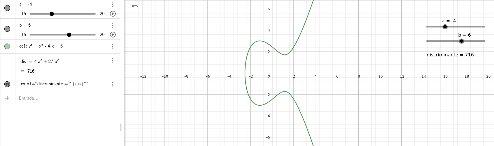
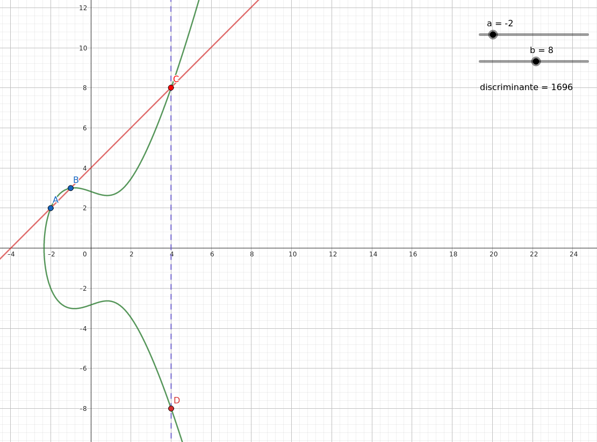

# Elliptic curve point addition

Creating our elliptic curve involves introducing the Weierstrass equation as a function of parameters a and b, represented by two sliders that allow us to modify the curve's shape in real-time. We also include the discriminator as an additional measure.



Next, we verify that the opAdd() function works for two points on the line and that the result corresponds to the intersection point of the line connecting those points and intersecting the curve. Graphically, for a curve with a=-2, b=8, and points A(-2,2,1) and B(-1,3,1), we obtain the intersection point C(4,8,1).

```
X-coordinate of point 1: -2
Y-coordinate of point 1: 2
Z-coordinate of point 1: 1
P1 = { -2.000000, 2.000000, 1.000000 }

X-coordinate of point 1: -1
Y-coordinate of point 1: 3
Z-coordinate of point 1: 1
P1 = { -1.000000, 3.000000, 1.000000 }
-----------------------------------------

P1 + P2 = { 4.000000, -8.000000, 1.000000 }
```

Geogebra, we simply draw a vertical line through point C to obtain intersection point D on the curve.


